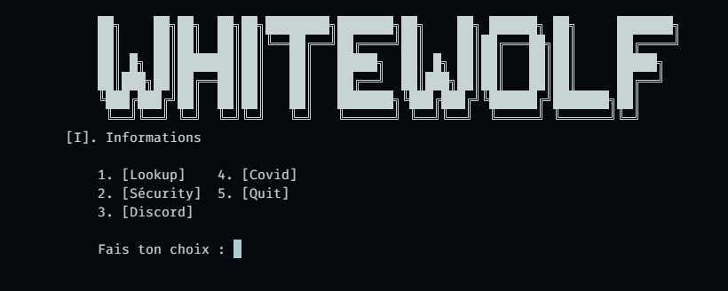

# WhiteWolf Tools

Suite d'outils en ligne de commande (CLI) pour **OSINT**, **sécurité**, **Discord** et utilitaires divers. Interface en menus ASCII — lance tout depuis `main.py`.

> **Python 3 requis** — Windows recommandé (certaines fonctions utilisent `msvcrt`, Microsoft Edge, `taskkill`, `mss`, etc.).

---

## Structure du projet

```
WHITEWOLF-TOOLS/
├── main.py                        # Point d'entrée — menus et dispatch vers les handlers
├── api.py                         # Clés API (ipify, apilayer, viewdns) — ignoré par Git
├── sites.py                       # Plateformes pour le lookup username
├── darkweb.py                     # Liens .onion par catégorie (menu Discord → Darkweb)
├── covid.py                       # Script autonome (voir section Covid)
├── scanner.py                     # Scan de tokens Discord (navigateurs + app Discord)
├── builder.py                     # Build .exe de covid.py (PyArmor + PyInstaller)
├── Icon.ico                       # Icône du projet
├── Virus-explain.md               # Guide rapide pour covid.py + builder
├── SECURITY.md                    # Avertissements légaux et responsabilité
├── requirements.txt               # Dépendances pip
├── image/
│   └── whitewolf.png              # Image du projet
├── proxy/                         # Dossier proxy (ressources)
└── code/
    ├── core/                      # Handlers core (RPC, devtools, informations)
    │   ├── rpc.py                 # Discord Rich Presence
    │   ├── devtools.py            # Outil ASCII art dev
    │   └── menu.py                # Affichage des informations
    ├── lookup/                    # Handlers menu Lookup
    │   ├── username_lookup.py     # Lookup multi-sites
    │   ├── google_search.py       # Recherche Google
    │   ├── dns_lookup.py          # Lookup DNS / abuse contact
    │   ├── discord_lookup.py      # Lookup profil Discord (vaultcord)
    │   ├── github_lookup.py       # Lookup dernier commit GitHub
    │   ├── leak_check.py          # Vérification fuites email (leakcheck.io)
    │   └── archive_check.py       # Snapshots Wayback Machine
    ├── security/                  # Handlers menu Security
    │   ├── proxy.py               # VPN/Proxy via Edge
    │   ├── password_gen.py        # Générateur de mots de passe
    │   ├── web_status.py          # Vérification temps de réponse site
    │   ├── scraper.py             # Récupération headers HTTP
    │   └── whois_lookup.py        # Lookup WHOIS domaine
    ├── discord/                   # Handlers menu Discord
    │   ├── nitro.py               # Génération codes Nitro
    │   ├── webhook_spam.py        # Spam webhook Discord
    │   ├── darkweb_display.py     # Affichage liens .onion
    │   ├── token_tools.py         # Génération token factice depuis ID
    │   └── bot_invite.py          # URL d'invitation bot OAuth2
    ├── covid/                     # Handlers menu Covid
    │   ├── keylogger.py           # Keylogger → webhook Discord
    │   ├── ip_grab.py             # Récupération IP publique → webhook
    │   ├── screenshot.py          # Capture d'écran → webhook
    │   └── build.py               # Build covid.exe (config + builder)
    ├── modules/                   # Modules métier existants
    │   ├── discordchecker.py      # 4C Checker Discord
    │   ├── tiktokchecker.py       # 4C Checker TikTok
    │   ├── githubchecker.py       # 4C Checker GitHub (pseudos disponibles)
    │   ├── ipscanner.py           # Scanner de ports (1–65535) via socket
    │   ├── nukerdiscord.py        # Discord Nuker bot (WIP)
    │   ├── mrrobot.py             # Script Mr Robot
    │   ├── genip.py               # Génération d'IP aléatoires → webhook
    │   ├── Spamtlgrm.py           # Spam bot Telegram via token bot
    │   ├── passwordmanager.py     # Gestionnaire de mots de passe chiffré (Fernet)
    │   ├── ai.py                   # Chat AI (Groq)
    │   ├── robloxsearch.py        # Recherche utilisateur Roblox
    │   ├── letsenscript.py        # Vérification SSL/TLS
    │   ├── checking.py            # Vérification email (holehe)
    │   ├── rpc.py                 # Configuration RPC Discord
    │   ├── webcamcapt.py          # Capture webcam → webhook
    │   ├── tokencheck.py          # Vérification token Discord
    │   ├── embedsender.py         # Envoi embed via webhook
    │   ├── ipreputation.py        # Vérification réputation IP
    │   └── autofollowinsta.py     # Automation Instagram
    └── challange/
        ├── firstchallange.py      # Challenge OSINT interactif
        ├── pentestchallange.py    # Challenge Pentest Web
        └── templates/
            └── index.html         # Template challenge pentest
```

---

## Arbre des commandes (`main.py`)

```
python main.py
│
├── [I] Informations ─────────► Telegram, Guns.lol (5 s puis retour)
│
├── 1. LOOKUP
│   ├── [I] Informations
│   ├── 1.  IP ──────────────────► geo.ipify.org (pays, ville, ISP, VPN)
│   ├── 2.  Number ──────────────► apilayer.net (pays, format, opérateur)
│   ├── 3.  Username ────────────► scan multi-sites (`code/lookup/username_lookup.py`)
│   ├── 4.  Google ──────────────► ouvre la recherche (`code/lookup/google_search.py`)
│   ├── 5.  DNS ─────────────────► viewdns.info abuse contact (`code/lookup/dns_lookup.py`)
│   ├── 6.  Discord ─────────────► vaultcord profil par ID (`code/lookup/discord_lookup.py`)
│   ├── 7.  Github ──────────────► dernier commit public (`code/lookup/github_lookup.py`)
│   ├── 8.  Leak Mail ───────────► leakcheck.io → result.json (`code/lookup/leak_check.py`)
│   ├── 9.  Archive Web ─────────► archive.org snapshots (`code/lookup/archive_check.py`)
│   ├── 10. 4C Tiktok ───────────► checker TikTok (`code/modules/tiktokchecker.py`)
│   ├── 11. 4C Github ───────────► checker GitHub (`code/modules/githubchecker.py`)
│   ├── 12. Github Check ────────► checker GitHub (`code/modules/githubchecker.py`)
│   ├── 13. IP Scanner ──────────► scan ports 1–65535 (`code/modules/ipscanner.py`)
│   ├── 14. AI Chat ─────────────► chat IA Groq (`code/modules/ai.py`)
│   ├── 15. Roblox ──────────────► recherche user Roblox (`code/modules/robloxsearch.py`)
│   ├── 16. Holehe ──────────────► vérification email (`code/modules/checking.py`)
│   └── 17. Quit
│
├── 2. SECURITY
│   ├── [I] Informations
│   ├── 1.  PROXY (VPN) ─────────► Edge + proxy HTTP (`code/security/proxy.py`)
│   ├── 2.  Gen Password ────────► mot de passe aléatoire (`code/security/password_gen.py`)
│   ├── 3.  Status Website ──────► temps de réponse HTTP (`code/security/web_status.py`)
│   ├── 4.  Scraper ─────────────► en-têtes HTTP → result.txt (`code/security/scraper.py`)
│   ├── 5.  Whois ───────────────► whois domaine (`code/security/whois_lookup.py`)
│   ├── 6.  Gen IP ──────────────► génération IP aléatoires (`code/modules/genip.py`)
│   ├── 7.  Spam Telegram ───────► bot spam Telegram (`code/modules/Spamtlgrm.py`)
│   ├── 8.  Passwd Manager ──────► gestionnaire mots de passe (`code/modules/passwordmanager.py`)
│   ├── 9.  Osint ───────────────► challenge OSINT (`code/challange/firstchallange.py`)
│   ├── 10. Pentest Web ─────────► challenge Pentest (`code/challange/pentestchallange.py`)
│   ├── 11. Webcam ──────────────► capture webcam (`code/modules/webcamcapt.py`)
│   ├── 12. IP Reputation ───────► réputation IP (`code/modules/ipreputation.py`)
│   └── 13. Quit
│
├── 3. DISCORD
│   ├── [I] Informations
│   ├── 1. Nitro Gen ───────────► codes gift aléatoires (`code/discord/nitro.py`)
│   ├── 2. Spaming Webhook ─────► POST en boucle (`code/discord/webhook_spam.py`)
│   ├── 3. Darkweb ─────────────► affiche liens .onion (`code/discord/darkweb_display.py`)
│   ├── 4. Token BruteForce ────► génère token factice (`code/discord/token_tools.py`)
│   ├── 5. Bot to id ───────────► URL OAuth2 bot (`code/discord/bot_invite.py`)
│   ├── 6. 4C Checker ──────────► checker Discord (`code/modules/discordchecker.py`)
│   ├── 7. RPC Conf ────────────► config RPC Discord (`code/modules/rpc.py`)
│   ├── 8. Token Check ─────────► vérif token Discord (`code/modules/tokencheck.py`)
│   ├── 9. Webhook Sender ──────► envoi embed (`code/modules/embedsender.py`)
│   └── 10. Quit
│
├── 4. COVID (menu utilitaires)
│   ├── 1. KeyLogger ───────────► frappe clavier → webhook (`code/covid/keylogger.py`)
│   ├── 2. Grabing IP ──────────► IP publique → webhook (`code/covid/ip_grab.py`)
│   ├── 3. ScreenShot ──────────► capture d'écran → webhook (`code/covid/screenshot.py`)
│   ├── 4. Build Covid ─────────► compile covid.exe (`code/covid/build.py`)
│   └── 5. Quit
│
└── 5. Quit (accueil)
```

**Raccourci global :** `[I]` ou `[i]` sur chaque sous-menu → `show_informations()`.

---

## Détail des fonctionnalités

### Lookup (1)

| Choix          | Entrée           | API / source                                | Sortie                            |
| -------------- | ---------------- | ------------------------------------------- | --------------------------------- |
| IP             | Adresse IP       | [ipify](https://geo.ipify.org)              | IP, pays, ville, ISP, VPN         |
| Number         | Numéro E.164     | [apilayer](http://apilayer.net)             | Pays, formats, carrier            |
| Username       | Pseudo           | 30+ sites (`sites.py`)                      | URLs où le profil répond 200      |
| Google         | Requête          | Navigateur système                          | Onglet Google Search              |
| DNS            | Domaine          | [viewdns](https://api.viewdns.info)         | Abuse contact                     |
| Discord        | ID utilisateur   | vaultcord.com                               | username, avatar, flags, clan…    |
| Github         | user + repo      | api.github.com                              | email/nom/date du dernier commit  |
| Leak Mail      | Email            | leakcheck.io                                | `result.json`                     |
| Archive Web    | URL              | archive.org                                 | Snapshot Wayback le plus proche   |
| 4C Tiktok      | Nombre + webhook | `code/modules/tiktokchecker.py`             | Résultats via webhook             |
| 4C Github      | Nombre + webhook | `code/modules/githubchecker.py`             | Résultats via webhook             |
| Github Check   | Pseudo GitHub    | `code/modules/githubchecker.py`             | Statut disponibilité du pseudo    |
| **IP Scanner** | Adresse IP       | `code/modules/ipscanner.py`                 | Liste des ports ouverts (1–65535) |
| AI Chat        | Question         | `code/modules/ai.py` (Groq)                 | Réponse IA                        |
| Roblox         | ID utilisateur   | `code/modules/robloxsearch.py`              | Profil Roblox                     |
| Holehe         | Email            | `code/modules/checking.py`                  | Comptes associés à l'email        |

**Sites username** (extrait) : GitHub, Reddit, TikTok, Instagram, X, Facebook, Twitch, Steam, GitLab, Medium, Roblox, Chess.com, Linktree, Gravatar… — liste complète dans `sites.py`.

### IP Scanner (`code/modules/ipscanner.py`)

Scanner de ports TCP complet sur une IP cible :

- Teste les **65 535 ports** via `socket.connect_ex` (timeout 100 ms)
- Affiche uniquement les **ports ouverts**
- Interface interactive via `questionary`

### Security (2)

| Choix          | Description                                                                                                                         |
| -------------- | ----------------------------------------------------------------------------------------------------------------------------------- |
| PROXY (VPN)    | Lance Edge avec `--proxy-server`, vérifie l'IP via ipify, arrêt au timeout ou touche clavier (`code/security/proxy.py`)               |
| Gen Password   | `ascii_letters` + `digits` + `punctuation`, longueur ≥ 10 (`code/security/password_gen.py`)                                          |
| Status Website | `GET` sur l'URL → délai en millisecondes (`code/security/web_status.py`)                                                            |
| Scraper        | `HEAD` → affiche et enregistre les headers dans `result.txt` (`code/security/scraper.py`)                                            |
| Whois          | Informations WHOIS domaine (registrar, dates, DNS…) (`code/security/whois_lookup.py`)                                                |
| Gen IP         | Génère des adresses IP aléatoires et les envoie via webhook (`code/modules/genip.py`)                                                |
| Spam Telegram  | Bot spam Telegram — demande token bot + message, envoie en boucle (`code/modules/Spamtlgrm.py`)                                      |
| Passwd Manager | Gestionnaire mots de passe chiffré via Fernet (`code/modules/passwordmanager.py`)                                                   |
| Osint          | Challenge OSINT interactif (`code/challange/firstchallange.py`)                                                                     |
| Pentest Web    | Challenge Pentest Web (`code/challange/pentestchallange.py`)                                                                        |
| Webcam         | Capture webcam → webhook (`code/modules/webcamcapt.py`)                                                                             |
| IP Reputation  | Vérification réputation IP (`code/modules/ipreputation.py`)                                                                         |

### Discord (3)

| Choix            | Description                                                  | Fichier généré |
| ---------------- | ------------------------------------------------------------ | -------------- |
| Nitro Gen        | Teste `https://discord.gift/{16 chars}` en boucle (`code/discord/nitro.py`)                | `nitro.txt`    |
| Spaming Webhook  | Envoie `{ "content": message }` en POST (`code/discord/webhook_spam.py`)                   | —              |
| Darkweb          | Liste par catégorie (moteurs, marchés, wikis…) (`code/discord/darkweb_display.py`)         | —              |
| Token BruteForce | `base64(user_id).random.random` démo (`code/discord/token_tools.py`)                       | —              |
| Bot to id        | Lien `oauth2/authorize` admin (perm 8) (`code/discord/bot_invite.py`)                      | —              |
| 4C Checker       | Génération / vérification pseudos Discord (`code/modules/discordchecker.py`)                | —              |
| RPC Conf         | Configuration RPC Discord (`code/modules/rpc.py`)                                          | —              |
| Token Check      | Vérification token Discord (`code/modules/tokencheck.py`)                                   | —              |
| Webhook Sender   | Envoi embed via webhook (`code/modules/embedsender.py`)                                     | —              |

**Catégories Darkweb** (`darkweb.py`) : Search Engine, Bitcoin Anonymity, DDoS, Market, Cooks, Torrents, Social Media, Wikis, Government, Communities, Educational.

### Covid (4)

| Choix       | Description                                                                          |
| ----------- | ------------------------------------------------------------------------------------ |
| KeyLogger   | `pynput` → chaque touche postée sur un webhook (buffer 1 s) (`code/covid/keylogger.py`) |
| Grabing IP  | IP via `checkip.amazonaws.com` → webhook (`code/covid/ip_grab.py`)                   |
| ScreenShot  | Capture d'écran via `mss` → webhook Discord (`code/covid/screenshot.py`)             |
| Build Covid | Ouvre `builder.py` — compile `covid.py` en `covid-exe/Tools.exe` (`code/covid/build.py`) |

#### Script autonome `covid.py`

`covid.py` regroupe plusieurs actions au lancement (webhook à configurer ligne 40) :

1. **Discord injection** — scan des tokens via `scanner.py` (Chrome, Brave, Edge, Opera, Discord…)
2. **Grab IP** — envoi de l'IP publique
3. **Dir** — listing `dir /s` (tronqué à 1900 car.)
4. **Screenshot** — capture d'écran
5. **Dossier** — création de dossiers `Virus*` sur le bureau + ouverture de `cmd`
6. **Shutdown** — redémarrage forcé de la machine
7. **KeyLogger** — écoute clavier en arrière-plan

> Guide pas à pas : voir [`Virus-explain.md`](Virus-explain.md).

#### Builder (`builder.py`)

Pipeline de compilation :

1. Choix d'une icône `.ico` (dialogue Tkinter)
2. Obfuscation avec **PyArmor** (`obf/covid.py`)
3. Packaging **PyInstaller** (`--onefile --noconsole`) → `covid-exe/Tools.exe`

Dépendances build : `pyarmor`, `pyinstaller`.

#### Scanner (`scanner.py`)

Scan des tokens Discord stockés localement :

- Navigateurs Chromium (Chrome, Brave, Edge, Opera, Vivaldi, Yandex…)
- Applications Discord (stable, PTB, Canary, Dev)
- Décryptage via `win32crypt` + `pycryptodome` (optionnel)

Test en standalone :

```bash
python scanner.py
```

### Discord Nuker (`code/nukerdiscord.py`)

> ⚠️ **WIP** — En cours de développement (rate limiting Discord en cours de résolution).

Bot de nuker Discord via token :

- Demande un **token bot** et un **ID de serveur**
- Récupère la liste des membres du serveur
- Ban automatiquement tous les membres

### Password Manager (`code/modules/passwordmanager.py`)

Gestionnaire de mots de passe avec chiffrement **Fernet** (symétrique AES) :

| Option    | Description                                                 |
| --------- | ----------------------------------------------------------- |
| Gen Key   | Génère une clé Fernet → `key.txt`                           |
| Add Mdps  | Chiffre un mot de passe avec la clé → `encrypted.txt`       |
| List mdps | Déchiffre et affiche le mot de passe depuis `encrypted.txt` |

> ⚠️ Conserve ta `key.txt` — sans elle, le déchiffrement est impossible.

### Spam Telegram (`code/modules/Spamtlgrm.py`)

Bot spam Telegram activé via la commande `/start` :

- Demande un **token bot** Telegram et un **message** à spammer
- Envoie le message **98 fois** à chaque commande `/start`
- Fonctionne en boucle continue (`run_polling`)

### Challenge OSINT (`code/challange/firstchallange.py`)

Challenge de géolocalisation OSINT interactif basé sur une image (`osint.png`) :

| Question                        | Format attendu                                          |
| ------------------------------- | ------------------------------------------------------- |
| Nom de la ville                 | minuscules                                              |
| Nom de l'office de tourisme     | minuscules (sans le préfixe "Destination Méditerranée") |
| Date de publication de la photo | `jj/mm/aaaa`                                            |

Score sur 3 points — un point par bonne réponse.

### Challenge Pentest Web (`code/challange/pentestchallange.py`)

Challenge interactif orienté pentest web — accessible depuis Security → 10.

---

## Installation

```bash
git clone <url-du-repo>
cd WHITEWOLF-TOOLS
pip install -r requirements.txt
python main.py
```

### Dépendances (`requirements.txt`)

| Package               | Usage                                               |
| --------------------- | --------------------------------------------------- |
| `requests`            | Toutes les requêtes HTTP                            |
| `pynput`              | KeyLogger (menu Covid + `covid.py`)                 |
| `mss`                 | Captures d'écran                                    |
| `python-telegram-bot` | Spam bot Telegram (`code/modules/Spamtlgrm.py`)     |
| `python-whois`        | Lookup WHOIS (`code/security/whois_lookup.py`)      |
| `cryptography`        | Chiffrement Fernet (`code/modules/passwordmanager.py`) |
| `pillow`              | Manipulation d'images                               |
| `pywin32`             | Décryptage des tokens (`scanner.py`)                |
| `pycryptodome`        | Décryptage AES cookies Chromium (`scanner.py`)      |
| `pyarmor`             | Obfuscation avant build (`builder.py`)              |
| `pyinstaller`         | Compilation en `.exe` (`builder.py`)                |
| `pypresence`          | Discord Rich Presence (`code/core/rpc.py`)          |
| `questionary`         | Interface interactive (`code/modules/ipscanner.py`, `code/modules/robloxsearch.py`) |
| `holehe`              | Vérification email (`code/modules/checking.py`)     |
| `instagrapi`          | Automation Instagram (`code/modules/autofollowinsta.py`) |
| `questionary`         | Interface de sélection interactive (`ipscanner.py`) |
| `discord.py`          | Discord Nuker (`code/nukerdiscord.py`)              |

Modules standard utilisés : `os`, `time`, `json`, `webbrowser`, `msvcrt`, `tempfile`, `subprocess`, `random`, `string`, `base64`, `threading`, `socket`, `sqlite3`, `io`, `tkinter`.

---

## Configuration API (`api.py`)

Le fichier `api.py` est **ignoré par Git** (`.gitignore`). Crée-le à la racine du projet :

```python
api_ip = "ta_cle_ipify"
api_number = "ta_cle_apilayer"
api_dns = "ta_cle_viewdns"
```

| Variable     | Service                                      | Utilisé pour       |
| ------------ | -------------------------------------------- | ------------------ |
| `api_ip`     | [geo.ipify.org](https://geo.ipify.org)       | Lookup IP          |
| `api_number` | [apilayer.net](http://apilayer.net)          | Lookup téléphone   |
| `api_dns`    | [api.viewdns.info](https://api.viewdns.info) | Lookup DNS / abuse |

Remplace les valeurs par **tes propres clés** — ne commite jamais de secrets en public.

Les autres lookups (Discord, Github, Leak Mail, Google, Archive) n'utilisent pas `api.py`.

---

## Fichiers générés à l'exécution

| Fichier / dossier         | Créé par                                            |
| ------------------------- | --------------------------------------------------- |
| `result.json`             | Lookup → Leak Mail                                  |
| `result.txt`              | Security → Scraper                                  |
| `nitro.txt`               | Discord → Nitro Gen (codes potentiellement valides) |
| `key.txt`                 | Security → Passwd Manager → Gen Key                 |
| `encrypted.txt`           | Security → Passwd Manager → Add Mdps                |
| `covid-exe/Tools.exe`     | Covid → Build Covid (`builder.py`)                  |
| `build/`, `dist/`, `obf/` | Dossiers temporaires du builder (supprimés/recréés) |

---

## Fichiers ignorés par Git (`.gitignore`)

| Fichier / pattern                  | Raison                                |
| ---------------------------------- | ------------------------------------- |
| `api.py`                           | Clés API secrètes                     |
| `*.json`, `*.txt`                  | Fichiers de résultats et clés générés |
| `*.log`, `*.tmp`                   | Fichiers temporaires                  |
| `ransom_ware.py`                   | Script sensible exclu du dépôt        |
| `__pycache__/`, `*.pyc`            | Bytecode Python                       |
| `env/`, `venv/`, `.venv/`          | Environnements virtuels               |
| `.env`, `config.json`, `keys.json` | Configs secrètes                      |
| `profile/`, `webdriver/`           | Données de session navigateur         |

---

## Liens & crédits

- **Telegram** — https://t.me/whitewolf_tools
- **Guns.lol** — https://guns.lol/xqldev

---

## Avertissement

Utilise ces outils uniquement sur des systèmes et des données **dont tu as l'autorisation**. Les fonctions type keylogger, scan de tokens, spam webhook, nuker ou génération de tokens peuvent violer les lois et les conditions d'utilisation des services concernés.

Consulte [`SECURITY.md`](SECURITY.md) pour les conditions complètes d'utilisation et de responsabilité.

## Image



---

_Love My friends :)_ — _Don't wait, just do it :)_
